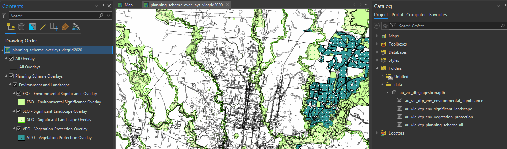
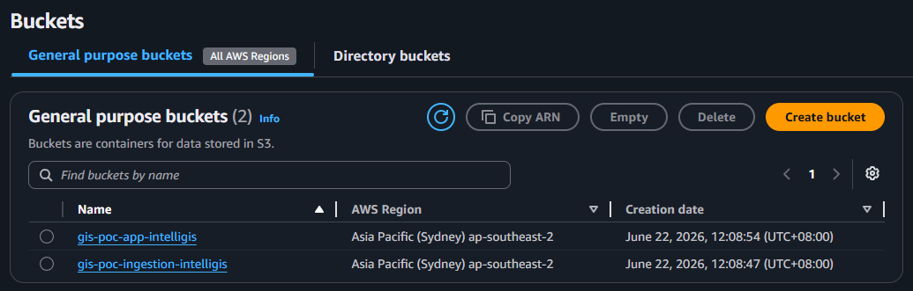
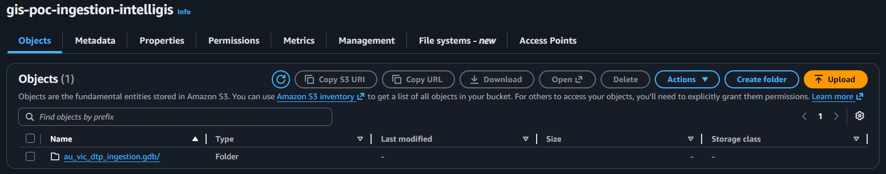
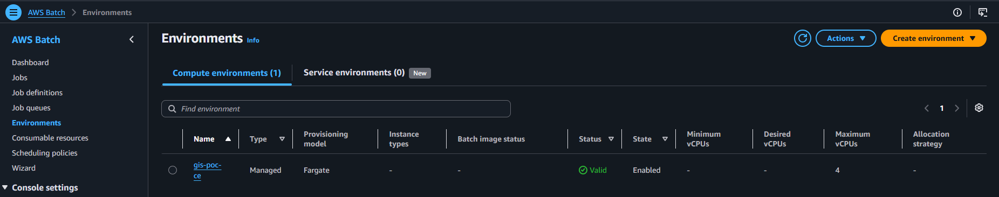
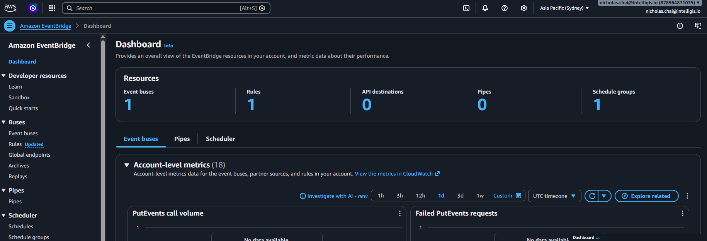
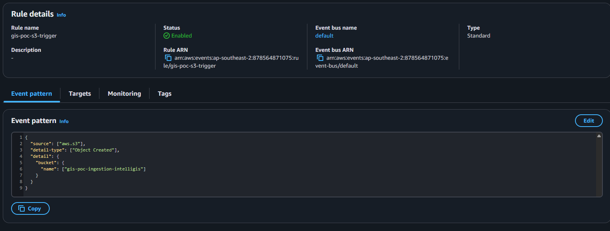

## 0.0 Setup AWS CLI Tools

Before we do anything - make sure you have Docker installed and the AWS CLI tools. Install the AWS CLI tools with this:

`winget install --id Amazon.AWSCLI -e`

Restart VS Code/Terminal then run this to check its working on your machine.

`aws --version`

Then run this to get your ids:

`aws sts get-caller-identity`

## 1.0 Data Ingestion Pipeline Setup

First job on this is to setup the GIS data ingestion pipeline, this is the S3 ingestion data bucket -> AWS Fargate running a docker container with a python script in it -> S3 Output/App Data bucket. Then later we will setup a lambda to trigger the python script (fargate) execution whenever new data goes into the ingestion bucket.

to start we are going to prepare some sample vector data into a geodatabase using ArcGIS Pro, this is the data prepared for this initial stage of development:



in the mean time it is sitting on the local disk of the dev machine (ie not in s3 bucekt yet), follow along once you have this ready.

### 1.1 Install + configure AWS CLI

First we need local tools to be able to do things into the AWS account we want to work on (make sure you have an aws account already setup via the browser/gui). 

- In terminal install the AWS tools with `winget install --id Amazon.AWSCLI -e`
- restart terminal (and vscode if you are working in there) and run `aws --version` to confirm you've got the tools working.
- next you need to login your newly installed local AWS cli tools into your AWS console. To do this, in your browser window in the `console.aws.amazon.com` 
    - click your name in the top right
    - click Security credentials
    - under Access keys section click "Create Access Key"
    - once created you will get the access key name and secret
- next, run `aws configure`
    - put in your id and secret, default region name and output format should be like this:
    ```
    AWS Access Key ID [None]: XXX------------XX
    AWS Secret Access Key [None]: XX--------------X
    Default region name [None]: ap-southeast-2
    Default output format [None]: json
    ```
- check everything is good with `aws sts get-caller-identity`

### 1.2 Create the S3 Buckets + upload the GDB

In this section we just create some S3 buckets using the CLI tools we just setup.

- Run the below commands to make 2 buckets into S3
    ```
    # pick your region once
    $REGION = "ap-southeast-2"
    $ING = "gis-poc-ingestion-intelligis"
    $APP = "gis-poc-app-intelligis"

    aws s3api create-bucket --bucket $ING --region $REGION --create-bucket-configuration LocationConstraint=$REGION
    aws s3api create-bucket --bucket $APP --region $REGION --create-bucket-configuration LocationConstraint=$REGION
    ```
- Next I just used the gui to check that the buckets were created:
    
- Now using the S3 GUI in your browser, just go into the ingestion bucket and upload the whole .gdb folder into it (GDBs are made up of lots of files) once uploaded your bucket should have the gdb in it like this:
    
- Now we are ready with data to work with.

### 1.3 Setup Docker, AWS ECR and push image

Now that we have data ready, we will next setup the docker image with our process_data.py file. Look through these files to see what they do in detail but the Dockerfile defines the container that we are registering in ECR and will be used to host the data processing script that will move the data later via AWS Fargate and the process_data.py is the python code that will do the work.

- run the below to create the container registry that will house the image (remeber you got your account ID from running `aws sts get-caller-identity` earlier):
    ```
    $ACCT = "<your-account-id>"
    aws ecr create-repository --repository-name gis-poc-pipeline --region $REGION
    ```
- next, log your local docker into the new ECR (make sure you have docker installed locally ofcourse):
    ```
    $REPO = "$ACCT.dkr.ecr.$REGION.amazonaws.com/gis-poc-pipeline"

    aws ecr get-login-password --region $REGION | docker login --username AWS --password-stdin "$ACCT.dkr.ecr.$REGION.amazonaws.com"

    cd d:\Development\aws-gis-poc\pipeline
    docker build -t gis-poc-pipeline .
    docker tag gis-poc-pipeline:latest "${REPO}:latest"
    docker push "${REPO}:latest"
    ```
- ok your docker image is now ready in ECR so we can use it in fargate next.

### 1.4 Setup Batch compute and Fargate

next we need some roles in IAM for the batch job to run under look at the job-role-policy.json and trust-policy.json files and update them if required (ie probably the bucket names will need adjusting). Then run the below
- setup execution roll (pull image + logs):
```
aws iam create-role --role-name gisPocBatchExecutionRole --assume-role-policy-document file://trust-policy.json
aws iam attach-role-policy --role-name gisPocBatchExecutionRole --policy-arn arn:aws:iam::aws:policy/service-role/AmazonECSTaskExecutionRolePolicy
```
- setup job role (scripts s3 permissions):
```
aws iam create-role --role-name gisPocBatchJobRole --assume-role-policy-document file://trust-policy.json
aws iam put-role-policy --role-name gisPocBatchJobRole --policy-name gisPocS3Access --policy-document file://job-role-policy.json
```

- Next, we will create the compute environment which will be fargate hosted by AWS Batch. this command will need to konw a few things like the Subnet or network to create the compute resource on and the security groups that have access to execute things on it to get these value you can run this:
```
$VPC = (aws ec2 describe-vpcs --filters "Name=isDefault,Values=true" --query "Vpcs[0].VpcId" --output text)
$SUBNET = (aws ec2 describe-subnets --filters "Name=vpc-id,Values=$VPC" --query "Subnets[0].SubnetId" --output text)
$SG = (aws ec2 describe-security-groups --filters "Name=vpc-id,Values=$VPC" "Name=group-name,Values=default" --query "SecurityGroups[0].GroupId" --output text)
$VPC; $SUBNET; $SG
```
- that will store the required values into the variables, next we can cleanly run the create compute environment:
    ```
    aws batch create-compute-environment `
        --compute-environment-name gis-poc-ce `
        --type MANAGED `
        --compute-resources "type=FARGATE,maxvCpus=4,subnets=$SUBNET,securityGroupIds=$SG"
  ```
- next, we can check that this compute environment is valid and created by running the below command:
    ```
    aws batch describe-compute-environments `
        --compute-environments gis-poc-ce `
        --query "computeEnvironments[0].{State:state,Status:status,Reason:statusReason}" `
        --output table
    ```
    we can also check in the AWS Console on the browser under "AWS Batch":
    
    you can see in there that we have now got compute resources assigned as an enviornment for the jobs to run on using the `Fargate` provisioning model (as opposed to EC2).

- that takes care of the compute environment - now we need the job que that will use the environment to do the work:
    ```
    aws batch create-job-queue `
        --job-queue-name gis-poc-queue `
        --priority 1 `
        --compute-environment-order "order=1,computeEnvironment=gis-poc-ce"
    ```
    now we have a job que created, this will schedule in jobs for execution. So we have the environment for jobs to execute in, we have the job que so jobs can be prioritized by AWS Batch but we don't have the actual job definition yet (like ok what job do you want me to do). the job definition for this pipeline is defined in the `job-definition.json` file, next we will register this job definition. r
- first check the job-definition.json to make sure you have the correct strings, check the account id and region particularly within these strings:
    ```
        "image": "878564871075.dkr.ecr.ap-southeast-2.amazonaws.com/gis-poc-pipeline:latest",
        "executionRoleArn": "arn:aws:iam::878564871075:role/gisPocBatchExecutionRole",
        "jobRoleArn": "arn:aws:iam::878564871075:role/gisPocBatchJobRole",
    ```
- if these are looking good register the job definition with the below:
    ```
    cd d:\Development\aws-gis-poc\pipeline\batch
    aws batch register-job-definition --cli-input-json file://job-definition.json
    ```

### 1.5 Running the job to test the loop

in the previous steps we have completed the below:
1. Created our S3 Buckets for data storage (ingestion and output app bucket)
2. built the container image and pushed it up to ECR
3. setup a compute environment, job que and job definition in AWS Batch

Now we just need to run the job to test it we can do that with:

```
aws batch submit-job --job-name gis-poc-run1 --job-queue gis-poc-queue --job-definition gis-poc-job
```

wath the job going with:

```
aws batch list-jobs --job-queue gis-poc-queue --query "jobSummaryList[].[jobName,status]" --output table
```

or in the AWS Batch console page in your browser and then check S3 app output bucket to see the data. 

## 2.0 Setting up Event Bridge

Event bridge can be used to trigger the AWS Batch job when it detects updates on the ingestion bucket. This section will set it up for this project, first to enable notifications on the ingestion bucket then to run the batch via a rule.

### 2.1 Enable Event Bridge Notifications

The bucket is currently running silently event bridge doesn't know whats going on with it so first we have to enable notifications on the bucket so it starts reporting information to event bridge. 

Run the below to enable notifications on the ingestion bucket:

```
aws s3api put-bucket-notification-configuration --bucket $ING --notification-configuration '{\"EventBridgeConfiguration\":{}}'
```

Now all actions on this bucket are now being sent to the account's default event bridge 'bus'. Everything is being sent though, we only care about certain events so next we'll have to filter.

### 2.2 Setting up Roles for Event Bridge to use

First we'll need to setup roles so that event bridge can actually trigger the batch job on AWS Batch.

next we need a role for the event bridge to submit jobs once it notices something important has happened.

```
cd d:\Development\aws-gis-poc\pipeline\eventbridge

aws iam create-role --role-name gisPocEventBridgeRole --assume-role-policy-document file://trust-policy.json
```

so this creates a role for the event bridge to use.

```
aws iam put-role-policy --role-name gisPocEventBridgeRole --policy-name gisPocSubmitBatch --policy-document file://submit-batch-policy.json
```

then this is what permissions that role has, in this case we are allowing it to submit jobs in aws batch.

### 2.3 Setup the events

Events need to be setup in 2 parts, first is "what do you consider an event" in this case, it's when new objects are created in the ingestion bucket. Then the other half is "ok so once I've detected that specific event what do you want me to do" in this case we are running the AWS Batch process we setup in 1.4.

Setup the rule which tells event bridge what bucket to look at and then what to run once it's detected that a new item was put into it:

```
aws events put-rule --name gis-poc-s3-trigger --event-pattern file://event-pattern.json
```

so all events in s3 are showing up on the event bridget default bus, but this rule now specifically looks for "object created" events on that specific "gis-poc-ingestion-intelligis" bucket now. 

When it detects this then it should do something. So do what? well we have to give the rule a target which is what this is below:

```
aws events put-targets --rule gis-poc-s3-trigger --targets file://targets.json
```

the `targets.json` tells the rule what to do which is to run the batch job which was setup in 1.4 above.

### 2.4 Reviewing in AWS Console

Now this is setup every time a new item is put into the ingestion bucket, the bucket will notify event bridge, the rule will trigger the event and the event will run the AWS batch job "gis-poc-job" which will create the job that spins up the container using fargate compute resources which runs a python script. 

yes, its alot.. but this is the world we live in now. Anyway, you can see event bridge gui [here](https://ap-southeast-2.console.aws.amazon.com/events/home?region=ap-southeast-2#/dashboard)




### 2.5 Some Things to consider

If the event bridge rule is triggering the target (ie aws batch job) everytime a new file is created in the bucket, it will run the data processing script for each file in the geodatabase which is incredibly inefficeint. So the event-pattern.json file has been updated to also check that the newly created object in the bucket has a ".complete" at the end of the filename. So the target/batch job only runs once. the work flow would be:

1. upload the new gdb
2. once the gdb finished uploading, then upload a file called ".complete" to actually trigger the batch job.

yes this is very awkward, why not just have the uploader manually run the batch job by clicking a few things in the AWS console? either that or have it just run the batch on a schedule, we can do that by making a new aws event in event bridge using the same targets.json since its the same job:

```
cd d:\Development\aws-gis-poc\pipeline\eventbridge

# rate-based: every hour
aws events put-rule --name gis-poc-schedule --schedule-expression "rate(1 hour)"

# or cron-based: 6 fields, UTC -> e.g. 18:00 UTC daily
# aws events put-rule --name gis-poc-schedule --schedule-expression "cron(0 18 * * ? *)"

# attach the same Batch target (reuse the targets.json)
aws events put-targets --rule gis-poc-schedule --targets file://targets.json
```

this is something the business can consider, we could also make a gui that calls a lambda that then runs the batch job I suppose but would need considerable amount more thought before implementation..

## 3.0 Spatial Query API - AWS Lambda

AWS Lambda is used as the backend via function urls, it works by building a docker container for an app.py to live inside of. The Docker image (`/lambda/dockerfile`) is built on the lambda runtime interface client (RIC) which has everything it needs to handle lambda. 

The only thing it doesn't know about is what function to call, so in the dockerfile we define it like this:

```
CMD ["app.handler"]
```

this is the entry point for the lambda, then in the `app.py` there are functions that lambda knows to call a function in the app.py called `handler(event, context)` whenever a request comes in.  

In this handler call, aws will give handler an `event` which gives you information about the incomming http request you get the below for a **get** request: 

```
{
  "version": "2.0",
  "routeKey": "$default",
  "rawPath": "/",
  "rawQueryString": "action=list-layers",
  "headers": { "content-type": "application/json", "user-agent": "curl/8.0", ... },
  "queryStringParameters": { "action": "list-layers" },
  "requestContext": {
    "http": { "method": "GET", "path": "/", "sourceIp": "1.2.3.4", ... },
    "domainName": "abc123.lambda-url.ap-southeast-2.on.aws"
  },
  "body": null,
  "isBase64Encoded": false
}
```

then you have context as well whcih gives you runtime metadata, this is a lambdacontext object not a dict. It tells you about lambda environment things like "aws_request_id" or the time remaining before the lambda runs out of time to run

| Attribute                                            | What it is                                                                            |
| ---------------------------------------------------- | ------------------------------------------------------------------------------------- |
| `context.aws_request_id`                             | Unique ID for this invocation — great to log for tracing                              |
| `context.get_remaining_time_in_millis()`             | Milliseconds left before your timeout — useful to bail out of long queries gracefully |
| `context.function_name` / `context.function_version` | Identifies the Lambda function and version currently running                          |
| `context.memory_limit_in_mb`                         | Configured memory limit for the function                                              |
| `context.log_group_name` / `context.log_stream_name` | Where your logs go in CloudWatch                                                      |
| `context.invoked_function_arn`                       | Full ARN of the invoked Lambda function                                               |

AWS also ships off the "handlers" return - which needs to be a python dict describing the http response. it needs to look like this:

```
{
  "statusCode": 200,
  "headers": { "Content-Type": "application/json", ... },
  "body": "{\"layers\": [...]}"   # MUST be a string
}
```

other than this you can write your code however you want, in this poroject we have the lambda/queries/whatever.py to do actual work.

Outside of this, lambda also needs a role to run under and permissions on whatver it needs to access. These are defined here:

`lambda/iam/role-policy.json` and `lambda/iam/trust-policy.json`

finally, lambda also needs to have CORS rules defined so that the front-end can call it, this is defined here:

`lambda/iam/function-url-cors.json`

finally, to bring it all together there is a `/lambda/deploy.ps1` script that can be run to idempotently deploy the required policy and docker image to AWS IAM and AWS Lambda. 


## X.X Spatial Dataflow
TODO:
- GDAL is used to read the geodatabase and output **geoparquets**
    - no issues here works well and retains source CRS
- Tippacanoe is used to create **pmtile** files from the geodatabse feature classes
    - Tippacanoe needs geojson which means the source crs needs to convert from source to 4326 (WGS84) this could be an issue because the source is GDA2020 much more accurate that WGS84.
    - this process is also resource heavy, so i've had to pump the CPU and memory up on the job definition 

# APPENDIX

## Updating the process_data.py 

process_data.py is a python script that lives on the container for the AWS batch job to execute, if you want to update it you must login to the aws container registry first:

1. make your updates
2. make sure you have docker running on your local machine, make sure you have the aws CLI tools installed and runnning and refer to the .env file for the `$REGION`, `$ACCT` and `$REPO` values
3. run the below to deploy your processing changes:
    ```
    aws ecr get-login-password --region $REGION | docker login --username AWS --password-stdin "$ACCT.dkr.ecr.$REGION.amazonaws.com"
    docker build -t gis-poc-pipeline .
    docker tag gis-poc-pipeline:latest "${REPO}:latest"
    docker push "${REPO}:latest"
    ```

## Updating the iam policy

The IAM policy files live in `pipeline/iam`. Unlike the container, these are NOT baked into an image - AWS reads them when you run the command, so there is no docker rebuild here. You just re-apply the file and the change is live immediately.

There are two roles we manage:
- `gisPocBatchJobRole` - the permissions the script itself gets (read/delete ingestion, write app bucket). Defined in `job-role-policy.json`.
- `gisPocBatchExecutionRole` - lets Fargate pull the image + write logs. Uses an AWS-managed policy, you normally don't touch this.

To update the job role's permissions (eg you added a new S3 action like `s3:DeleteObject`):

1. edit `pipeline/iam/job-role-policy.json`
2. make sure you have the aws CLI tools installed and running
3. re-apply the policy with the below. `put-role-policy` OVERWRITES the existing inline policy with the same name, so there's nothing to delete first - just run it again:
    ```
    cd d:\Development\aws-gis-poc\pipeline\iam
    aws iam put-role-policy --role-name gisPocBatchJobRole --policy-name gisPocS3Access --policy-document file://job-role-policy.json
    ```
4. the next batch job that runs will use the new permissions, no rebuild/redeploy needed.

NOTE: the above is for the PERMISSIONS policy (what the role can do). If you instead change the TRUST policy (`trust-policy.json` - who is allowed to assume the role), that's a different command:
```
aws iam update-assume-role-policy --role-name gisPocBatchJobRole --policy-document file://trust-policy.json
```

## Updating the eventbridge

The eventbridge files live in `pipeline/eventbridge`. Same as the IAM policy - these are read by AWS when you run the command, so there's no docker rebuild, the change goes live straight away.

There are two parts you might change:

**The rule / event pattern** (`event-pattern.json`) - this is the "what counts as an event" filter (eg the bucket name, or the `.complete` suffix check). After editing it, re-apply the rule. `put-rule` with the same name OVERWRITES the existing rule's pattern, and your targets stay attached to it - so you do NOT need to re-run put-targets:
```
cd d:\Development\aws-gis-poc\pipeline\eventbridge
aws events put-rule --name gis-poc-s3-trigger --event-pattern file://event-pattern.json
```

**The target** (`targets.json`) - this is the "what do I run when the rule fires" part (the batch queue, the role, the job definition). After editing it, re-apply the targets. `put-targets` OVERWRITES any target with the same `Id`:
```
cd d:\Development\aws-gis-poc\pipeline\eventbridge
aws events put-targets --rule gis-poc-s3-trigger --targets file://targets.json
```

NOTE: if you ever change the EventBridge role's permissions (`submit-batch-policy.json`), that's an IAM update not an eventbridge one - re-apply it the same way as the job role above:
```
aws iam put-role-policy --role-name gisPocEventBridgeRole --policy-name gisPocSubmitBatch --policy-document file://submit-batch-policy.json
``` 

## General Script Driven Deployment

A powershell script has been written in thee `pipeline/deploy.ps1` folder to handle a full deployment of the aws configuration and you can use this to make deploying easier. This way you don't have to think about what you've updated and what needs to be run to get your changes in. This script will just update all the config in an idempotent way (no duplicates, just overwrites)

First, make sure you have docker running and your aws cli is working properly (check 0.0 if not) then run this:

```
powershell -ExecutionPolicy Bypass -File d:\Development\aws-gis-poc\pipeline\deploy.ps1
```

Also just make sure to update this deploy.ps1 script if you end up adding more policy or jobs etc.. that need to be updated on deployment.